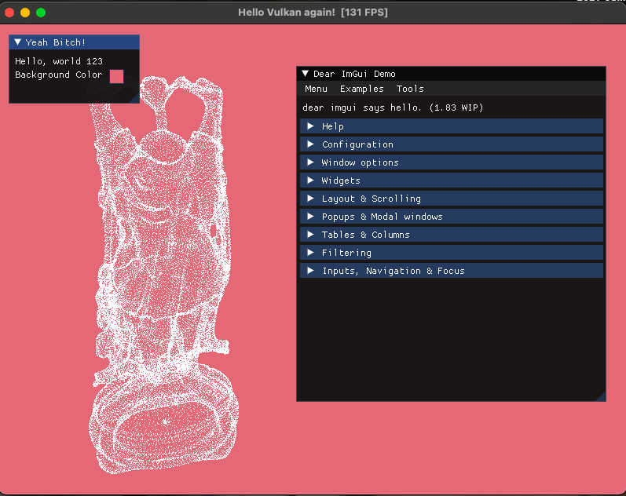
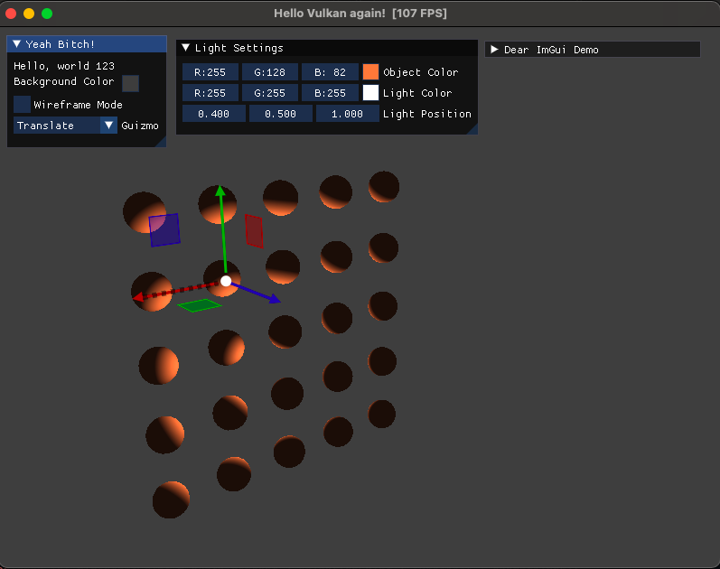

# Vulf

Vulf is my personal Vulkan Renderer and Sandbox, I use this to experiment and learn Vulkan and test some interesting features, It doesn't have any fancy rendering capabilities but has abstractions and features that help me implement anything. This is supposed to make my life easier.

### Features
- Vulkan objects Abstracted into reusable units
    - Create Renderpasses in one go
    - Create reusable command buffers
    - Easy to use VertexBuffer, IndexBuffer and UniformBuffer objects
    - Model loading + Cramped up Texture mapping in uniform buffers(This needs refactoring to be more user friendly)
    - Diffuse and ambient lighting demo scene
- Simple Camera system to move around the scene
- **ImGui Integration** that works out of the box and helps you integrate into your Vulkan app in a matter of few minutes + **ImGuizmo**

#### TODO Features:
- Reflection API to automatically generate Vertex Attributes, Uniform bufers and Descriptors from SPIR-V
- Automatic Uniform buffer management using SPIRV-Reflect
- Better renderpass and subpass management API for postFX + default PostFX effects ready to use
- Multithreaded Command buffer recording and execution model

This sandbox has a very simple and brief ImGui integration that makes it easy to use while extending your potentially modified version of Alexander Overvoorde's hello triangle Application (I had a hard time understanding the tutorials of [frguthmann](https://frguthmann.github.io/posts/vulkan_imgui/) and [SaschaWillems](https://github.com/SaschaWillems/Vulkan/blob/master/examples/imgui/main.cpp) examples on the web while extending from the hello triangle, since none of them actually use Alexander Overvoorde's hello triangle), it doesn't use any `ImGui_Impl_VulkanH` functions, only uses the ImguiImplVulknan backend files to make the integration as smooth and simple as possible with existing rendering. Read below for a detailed explanation on ImGui Integration.

**Read [VulfBaseDesign.md](./VulfBaseDesign.md) to understand the working of the `VulfBase` class**

## Screenshots





### ImGUI Integration in a nutshell
- Create a descriptor pool with different size as provided in [frguthmann](https://frguthmann.github.io/posts/vulkan_imgui/) tutorial, next use a single time command buffer to upload the font to GPU using a single queueSubmit. Next create multiple command buffers for each swapchain image and use ImGUI spedicif renderpass also explained how to do by frguthmann and in the DrawFrame submit 2 commandBuffers combined in an array and Voila you have Dear ImGui!

A more detailed ImGui flow is given below :

#### Important initialization steps
<details>
<summary>Descriptor pool creation (e.g. ImGui demo)</summary>
<br>

```c++
VkDescriptorPoolSize pool_sizes[] = {
    {VK_DESCRIPTOR_TYPE_SAMPLER,                1000},
    {VK_DESCRIPTOR_TYPE_COMBINED_IMAGE_SAMPLER, 1000},
    {VK_DESCRIPTOR_TYPE_SAMPLED_IMAGE,          1000},
    {VK_DESCRIPTOR_TYPE_STORAGE_IMAGE,          1000},
    {VK_DESCRIPTOR_TYPE_UNIFORM_TEXEL_BUFFER,   1000},
    {VK_DESCRIPTOR_TYPE_STORAGE_TEXEL_BUFFER,   1000},
    {VK_DESCRIPTOR_TYPE_UNIFORM_BUFFER,         1000},
    {VK_DESCRIPTOR_TYPE_STORAGE_BUFFER,         1000},
    {VK_DESCRIPTOR_TYPE_UNIFORM_BUFFER_DYNAMIC, 1000},
    {VK_DESCRIPTOR_TYPE_STORAGE_BUFFER_DYNAMIC, 1000},
    {VK_DESCRIPTOR_TYPE_INPUT_ATTACHMENT,       1000}
};

VkDescriptorPoolCreateInfo pool_info = {};
pool_info.sType = VK_STRUCTURE_TYPE_DESCRIPTOR_POOL_CREATE_INFO;
pool_info.flags = VK_DESCRIPTOR_POOL_CREATE_FREE_DESCRIPTOR_SET_BIT;
pool_info.maxSets = 1000 * IM_ARRAYSIZE(pool_sizes);
pool_info.poolSizeCount = (uint32_t) IM_ARRAYSIZE(pool_sizes);
pool_info.pPoolSizes = pool_sizes;

VK_CALL(vkCreateDescriptorPool(context->getDevice().getVkDevice(),
    &pool_info, nullptr, &descriptorPool),
    "ImGui descriptor pool creation");
```
</details>

<details>
<summary>Creating a ImGui specific Renderpass</summary>
<br>

```c++

VkAttachmentDescription imguiAttachmentDesc = {};
imguiAttachmentDesc.format = swapchainManager.GetSwapFormat();
imguiAttachmentDesc.samples = VK_SAMPLE_COUNT_1_BIT;
imguiAttachmentDesc.loadOp = VK_ATTACHMENT_LOAD_OP_LOAD;
imguiAttachmentDesc.storeOp = VK_ATTACHMENT_STORE_OP_STORE;
imguiAttachmentDesc.stencilLoadOp = VK_ATTACHMENT_LOAD_OP_DONT_CARE;
imguiAttachmentDesc.stencilStoreOp = VK_ATTACHMENT_STORE_OP_DONT_CARE;
imguiAttachmentDesc.initialLayout = VK_IMAGE_LAYOUT_COLOR_ATTACHMENT_OPTIMAL;
imguiAttachmentDesc.finalLayout = VK_IMAGE_LAYOUT_PRESENT_SRC_KHR; // Since UI is the last render pass, now this will be used for presentation

// ImGui color attachment reference to be used by the attachment and this is described by the attachment Description
VkAttachmentReference imguiColorAttachmentRef = {};
imguiColorAttachmentRef.attachment = 0;
imguiColorAttachmentRef.layout = VK_IMAGE_LAYOUT_COLOR_ATTACHMENT_OPTIMAL;

// Create a subpass using the attachment reference
VkSubpassDescription imguiSubpassDesc{};
imguiSubpassDesc.pipelineBindPoint = VK_PIPELINE_BIND_POINT_GRAPHICS;
imguiSubpassDesc.colorAttachmentCount = 1;
imguiSubpassDesc.pColorAttachments = &imguiColorAttachmentRef;

// Create the sub pass dependency to communicate between different subpasses, we describe the dependencies between them
VkSubpassDependency imguiDependency{};
imguiDependency.srcSubpass = VK_SUBPASS_EXTERNAL;
imguiDependency.dstSubpass = 0;
imguiDependency.srcStageMask = VK_PIPELINE_STAGE_COLOR_ATTACHMENT_OUTPUT_BIT;
imguiDependency.dstStageMask = VK_PIPELINE_STAGE_COLOR_ATTACHMENT_OUTPUT_BIT;
imguiDependency.srcAccessMask = 0;
imguiDependency.dstAccessMask = VK_ACCESS_COLOR_ATTACHMENT_WRITE_BIT;

// Now create the imgui renderPass
VkRenderPassCreateInfo imguiRPInfo{};
imguiRPInfo.sType = VK_STRUCTURE_TYPE_RENDER_PASS_CREATE_INFO;
imguiRPInfo.attachmentCount = 1;
imguiRPInfo.pAttachments = &imguiAttachmentDesc;
imguiRPInfo.subpassCount = 1;
imguiRPInfo.pSubpasses = &imguiSubpassDesc;
imguiRPInfo.dependencyCount = 1;
imguiRPInfo.pDependencies = &imguiDependency;
if(VK_CALL(vkCreateRenderPass(VKDEVICE, &imguiRPInfo, nullptr, &imguiRenderPass)))
```
</details>

<details>
<summary>Initialization with ImGui_ImplGlfw_InitForVulkan and ImGui_ImplVulkan_Init</summary>
<br>

```c++
ImGui_ImplGlfw_InitForVulkan(window, true);

ImGui_ImplVulkan_InitInfo init_info = {};
init_info.Instance = context->get_handle().getVkInstance();
init_info.PhysicalDevice = context->getDevice().getVkPhysicalDevice();
init_info.Device = context->getDevice().getVkDevice();
init_info.QueueFamily = context->getDevice().getGraphicsQueueFamily();
init_info.Queue = context->getDevice().getGraphicsQueue();
init_info.DescriptorPool = descriptorPool;
init_info.MinImageCount = swapchain->imageCount;
init_info.ImageCount = swapchain->imageCount;
init_info.CheckVkResultFn = [](VkResult result) { VK_CALL(result, "Internal ImGui operation"); };
ImGui_ImplVulkan_Init(&init_info, imguiRenderPass);
```
</details>

<details>
<summary>Creation and upload of the font texture</summary>
<br>

```c++
context->executeTransient([](VkCommandBuffer commandBuffer) {
    return ImGui_ImplVulkan_CreateFontsTexture(commandBuffer);
});
ImGui_ImplVulkan_DestroyFontUploadObjects();
```
</details>

#### ImGui UI rendering in the render loop
<details>
<summary>Start new ImGui Frame</summary>
<br>

```c++
ImGui_ImplVulkan_NewFrame();
ImGui_ImplGlfw_NewFrame();
ImGui::NewFrame();
```
</details>

<details>
<summary>Calling of UI component functions</summary>
<br>

```c++
// Your own UI
```
</details>

<details>
<summary>Rendering to an ImDrawData</summary>
<br>

```c++
ImGui::Render();
ImDrawData *main_draw_data = ImGui::GetDrawData();
```
</details>

<details>
<summary>Vulkan rendering (instructions in the next header section)</summary>
<br>

```c++
// Vulkan rendering
```
</details>

<details>
<summary>[Optional] Multi-viewport support</summary>
<br>

```c++
if (ImGui::GetIO().ConfigFlags & ImGuiConfigFlags_ViewportsEnable) {
    ImGui::UpdatePlatformWindows();
    ImGui::RenderPlatformWindowsDefault();
}
```
</details>


#### Vulkan rendering procedure

<details>
<summary>Reset command pool, begin command buffer and begin render pass</summary>
<br>

```c++
VK_CALL(vkResetCommandPool(context->getDevice().getVkDevice(),
                                      commandPools[imageIndex].getVkCommandPool(), 0),
                   "Command buffer reset");

VkCommandBufferBeginInfo commandBufferBeginInfo = {};
commandBufferBeginInfo.sType = VK_STRUCTURE_TYPE_COMMAND_BUFFER_BEGIN_INFO;
commandBufferBeginInfo.flags |= VK_COMMAND_BUFFER_USAGE_ONE_TIME_SUBMIT_BIT;
VK_CALL(vkBeginCommandBuffer(commandBuffers[imageIndex],
                                        &commandBufferBeginInfo),
                   "Command buffer begin");

VkRenderPassBeginInfo renderPassBeginInfo = {};
renderPassBeginInfo.sType = VK_STRUCTURE_TYPE_RENDER_PASS_BEGIN_INFO;
renderPassBeginInfo.renderPass = renderPass;
renderPassBeginInfo.framebuffer = framebuffers[imageIndex];
renderPassBeginInfo.renderArea.extent = swapchain->extent;
vkCmdBeginRenderPass(commandBuffers[imageIndex], &renderPassBeginInfo, VK_SUBPASS_CONTENTS_INLINE);
```
</details>

<details>
<summary>ImGui_ImplVulkan_RenderDrawData with the ImDrawData</summary>
<br>

```c++
ImGui_ImplVulkan_RenderDrawData(draw_data, commandBuffers[imageIndex]);
```
</details>

<details>
<summary>End render pass and end command buffer</summary>
<br>

```c++
vkCmdEndRenderPass(commandBuffers[imageIndex]);

VkPipelineStageFlags wait_stage = VK_PIPELINE_STAGE_COLOR_ATTACHMENT_OUTPUT_BIT;
VkSubmitInfo info = {};
info.sType = VK_STRUCTURE_TYPE_SUBMIT_INFO;
info.waitSemaphoreCount = 1;
info.pWaitSemaphores = &syncObject.imageAvailableSemaphore;
info.pWaitDstStageMask = &wait_stage;
info.commandBufferCount = 1;
info.pCommandBuffers = &commandBuffers[imageIndex];
info.signalSemaphoreCount = 1;
info.pSignalSemaphores = &syncObject.renderFinishedSemaphore;

VK_CALL(vkEndCommandBuffer(commandBuffers[imageIndex]),
                   "Command buffer end");
```
</details>

<details>
<summary>Reset fences and submit to the graphics queue</summary>
<br>

```c++
vkResetFences(context->getDevice().getVkDevice(), 1, &syncObject.fence);

VK_CALL(vkQueueSubmit(context->getDevice().getGraphicsQueue(), 1, &info, syncObject.fence),
                   "Queue submit");
```
</details>


#### Important destruction steps

<details>
<summary>Wait for device idle</summary>
<br>

```c++
vkDeviceWaitIdle(context->getDevice().getVkDevice());
```
</details>

<details>
<summary>Shutdown ImGui</summary>
<br>

```c++
ImGui_ImplVulkan_Shutdown();
ImGui_ImplGlfw_Shutdown();
```
</details>

<details>
<summary>Destroy descriptor pool</summary>
<br>

```c++
vkDestroyDescriptorPool(context->getDevice().getVkDevice(), descriptorPool, nullptr);
```
</details>

**Tip:** _If your ImGui is looking pale or bleached out, change swap surface format from `VK_FORMAT_R8G8B8A8_SRGB` to `VK_FORMAT_R8G8B8A8_UNORM` and it should look fine._

## Building

(Assuming you have the environment variable `VULKAN_SDK` pointing to the SDK)

Use the CMake to build the application (currently only works )

```shell
mkdir build
cd build
cmake ..
make run
```

Once built, the program can be run from within the build directory using the `make run` command (even for changes)

For compiling the shaders use `./../src/shaders/glsl/compile-glsl.sh` from within the build directory (if you get permission erros use `chmod +x ../src/shaders/glsl/compile-glsl.sh` before running the shell script)

## Thanks to
*  [Alexander Overvoorde](https://vulkan-tutorial.com/) for his awesome Vulkan tutorial.
* [frguthmann](https://frguthmann.github.io/posts/vulkan_imgui/) for his awesome ImGui integration blog
* [SaschaWillems](https://github.com/SaschaWillems/Vulkan/blob/master/examples/imgui/main.cpp) for his examples
* [ocornut](https://github.com/ocornut/imgui) for Dear ImGui backend and example files
